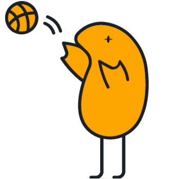
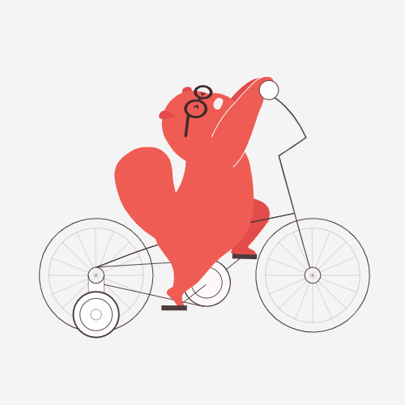
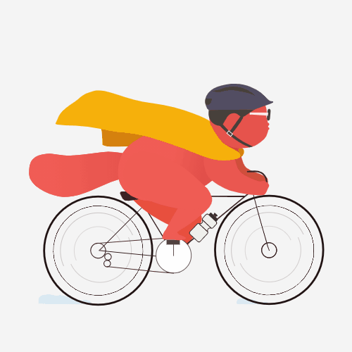

---
# Feel free to add content and custom Front Matter to this file.
# To modify the layout, see https://jekyllrb.com/docs/themes/#overriding-theme-defaults

layout: home
---

## Hey you

Do you wanna join my basketball team?

<!-- Begin Mailchimp Signup Form -->
<link href="//cdn-images.mailchimp.com/embedcode/slim-10_7.css" rel="stylesheet" type="text/css">

<form action="https://appsinacup.us5.list-manage.com/subscribe/post?u=583728a023d17acd66e79c18f&amp;id=ba2192dab6" method="post" id="mc-embedded-subscribe-form" name="mc-embedded-subscribe-form" class="validate" target="_blank" novalidate>
    

	<input type="email" value="" name="EMAIL" class="email" id="mce-EMAIL" placeholder="email address" required>
    <!-- real people should not fill this in and expect good things - do not remove this or risk form bot signups-->
    
<input type="text" name="b_583728a023d17acd66e79c18f_ba2192dab6" tabindex="-1" value="">

    
 <input type="submit" value="Subscribe" name="subscribe" id="mc-embedded-subscribe" class="button">

    

</form>

<!--End mc_embed_signup-->

## Tournaments

* Let's make teams, compete and have some fun.

## Improve

* Be motivated to go and play with your teammates.
* Exercise towards the goal of improving and participating to tournaments.

## Join

<!-- Begin Mailchimp Signup Form -->
<link href="//cdn-images.mailchimp.com/embedcode/slim-10_7.css" rel="stylesheet" type="text/css">

<form action="https://appsinacup.us5.list-manage.com/subscribe/post?u=583728a023d17acd66e79c18f&amp;id=ba2192dab6" method="post" id="mc-embedded-subscribe-form" name="mc-embedded-subscribe-form" class="validate" target="_blank" novalidate>
    

	<input type="email" value="" name="EMAIL" class="email" id="mce-EMAIL" placeholder="email address" required>
    <!-- real people should not fill this in and expect good things - do not remove this or risk form bot signups-->
    
<input type="text" name="b_583728a023d17acd66e79c18f_ba2192dab6" tabindex="-1" value="">

    
<input type="submit" value="Subscribe" name="subscribe" id="mc-embedded-subscribe" class="button">

    

</form>

<!--End mc_embed_signup-->